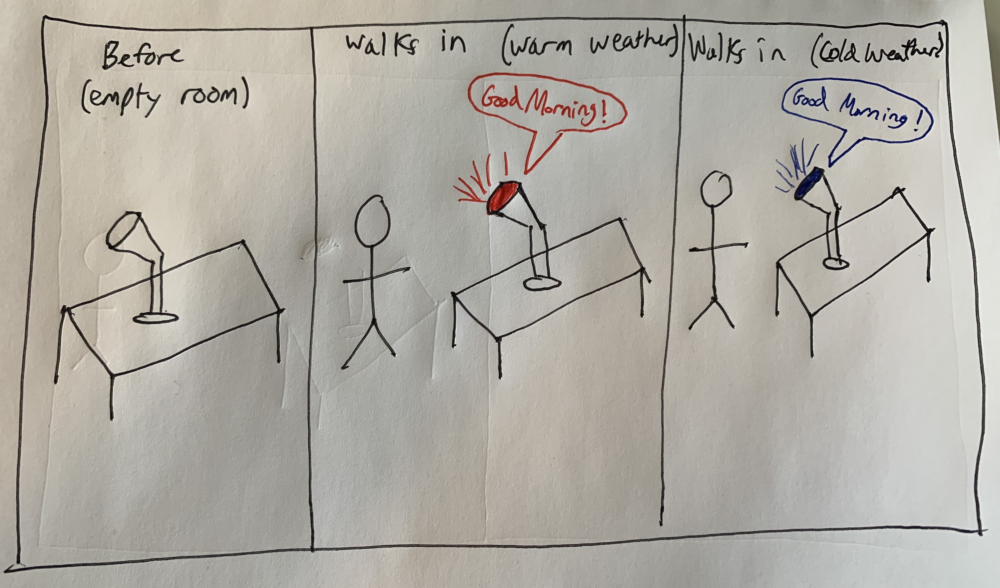
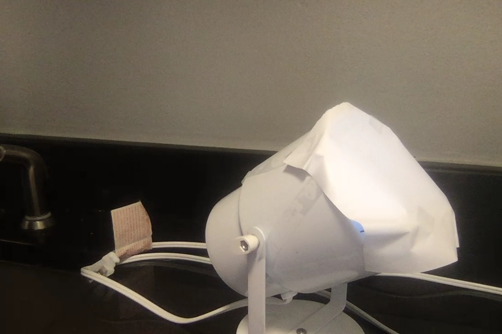

# Staging Interaction
 find them easily.

## Overview
For this assignment, you are going to 

A) [Plan](#part-a-plan) 

B) [Act out the interaction](#part-b-act-out-the-interaction) 

C) [Prototype the device](#part-c-prototype-the-device)

D) [Wizard the device](#part-d-wizard-the-device) 

E) [Costume the device](#part-e-costume-the-device)

F) [Record the interaction](#part-f-record)

## Part A. Plan 

**Describe your setting, players, activity and goals here.**

This device will be in each room of the house, and the players will be guests of the house. When a player enteres the room, the interactive device will tunr on and change colors depending on which room the player is in. The main host of the house can decide which rooms have the colors.

**Include a picture of your storyboard here**


**Summarize feedback you got here.**
* It would be cool if the device changed brightness depending on how close you are to it in the room.
* Maybe there could be a sound in each room that says 'welcome to "room {x}"'


## Part B. Act out the Interaction

**Are there things that seemed better on paper than acted out?**

* It was hard for the user to tell if the device was actually there or not.
* The device itself was too small for the user to see.

**Are there new ideas that occur to you or your collaborators that come up from the acting?**

* The device itself should be pretty noticeble to the user
* The costume should allow for the device to stand out in the room so that they know it is there
* The sounds and lighting should allow for the device to be the center of attention when they walk into the room.


## Part C. Prototype the device

**Give us feedback on Tinkerbelle.**

* I had trouble getting the phone and computer to sync up at times.
* There was occaasionally a lag in between when the control was pressed and the lighting changed colors

## Part D. Wizard the device


## Part E. Costume the device

**Include sketches of what your device might look like here.**


**What concerns or opportunitities are influencing the way you've designed the device to look?**

* The main goal of the costume is to allow the device to be noticable to the user in the room without it looking out of place
* It should be viewed as a main peice of furniture that fits into the room
* The device itself should blend into the room and be noticiable at the same time.


## Part F. Record

**Take a video of your prototyped interaction.**

The video is titled attempt.mov

It showcases how the scene would look if the device changed color as I entered a different room

<video width="320" height="240" controls>
  <source src="attempt.mov" type="video/mov">
</video>


# Staging Interaction, Part 2 

**Summarize feedback from your partners here.**

*	change colors depending on time of day
* change colors depending on weather
* have a different sound per room	

## Make it your own

**Document everything here.**

In part 2 of the lab, the device is now able to interact with the user using more data points than before to make the interaction more personable.
The device will turn on as a user enters the room, and will change color depending on the current temperature outside.  In addition, a audio recording will play that will greet the user and advise them on what to wear based on the current weather.

## Storyboard



## Device

The device was modified to allow for a better visualization of the light. Paper was taped over the front of the stand to mask the phone from being seen.
This gives off the impression that the light is a genuine source and operating indepently from the user.



## Changes to Tinkerbelle

In order to give off the illusion that the device was changing on its own, I modified the tinkerbelle script to operate on a timer. That way when recording the scene, I was able to walk right into the room and have the device change color instantly. In future iterations of this device, a motion sensor could be used to accomplish this.

```  var change = false;
  setInterval(function () {
    var hexCode;
    if (change) {
      hexCode = "#FFFFFF";
      change = false;
    } else {
      hexCode = "#0000FF";
      change = true;
    }
    // This will be executed every 10 seconds
    document.body.style.backgroundColor = hexCode;
    socket.emit('hex', hexCode)
  }, 10000);
```

## Video

The video is titled interaction.mp4

It showcases the device change to two different colors depending on what the weather would be that day. In addition, an audio file that I recorded plays to simulate the device interacting with the user. 

<video width="320" height="240" controls>
  <source src="interaction.mp4" type="video/mp4">
</video>