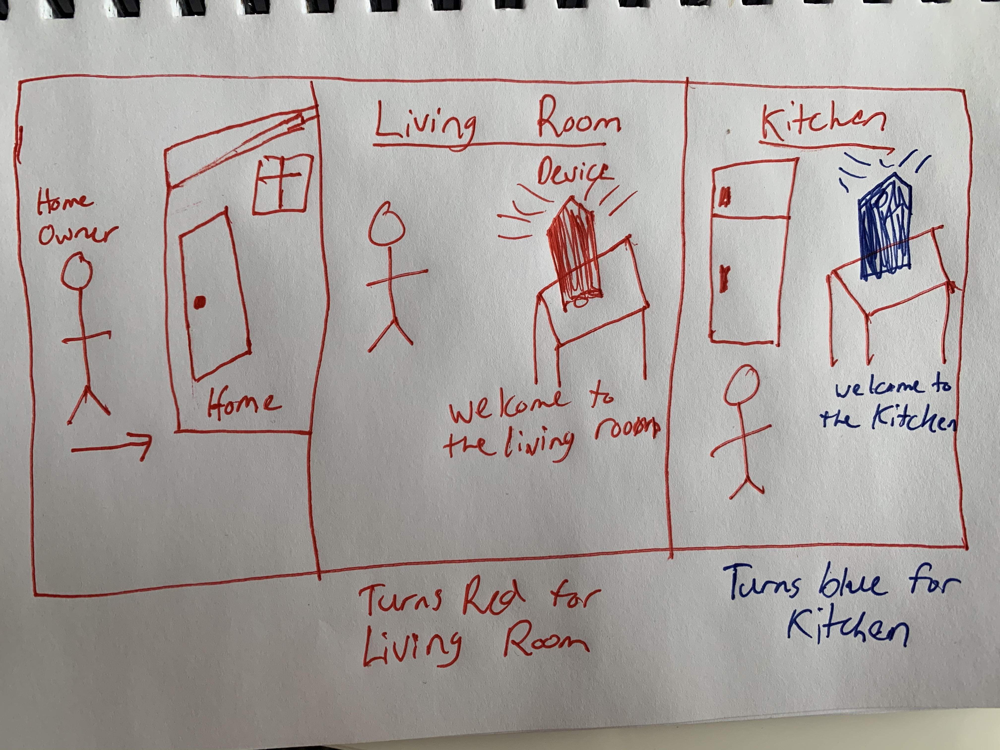
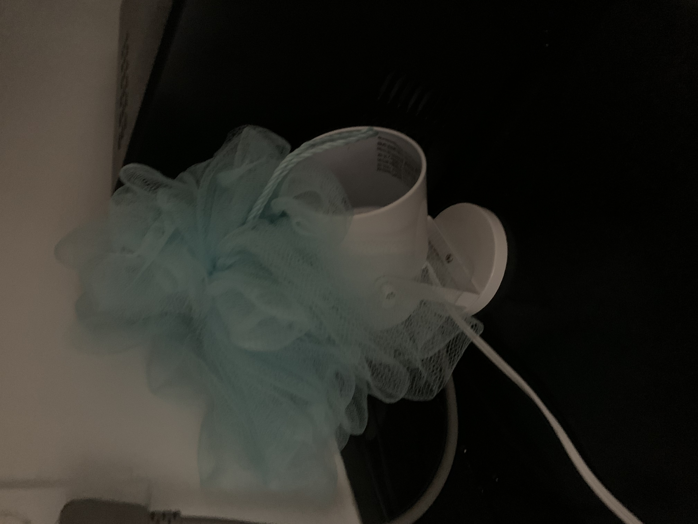
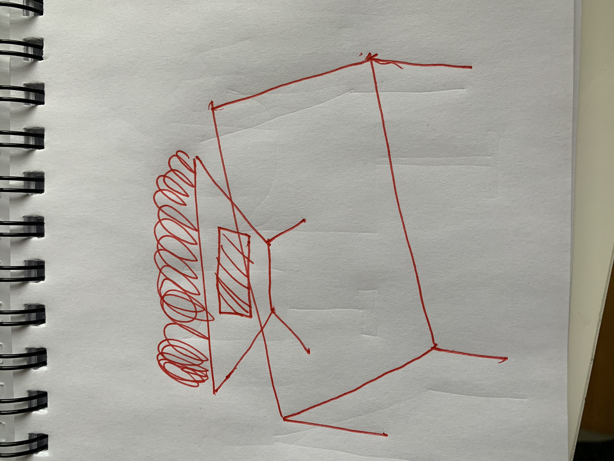
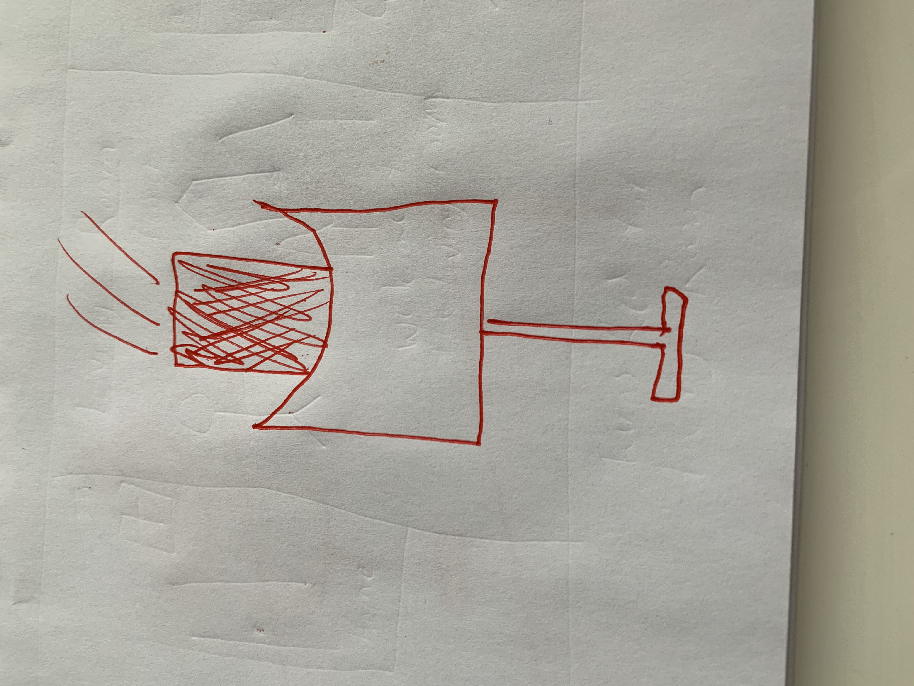
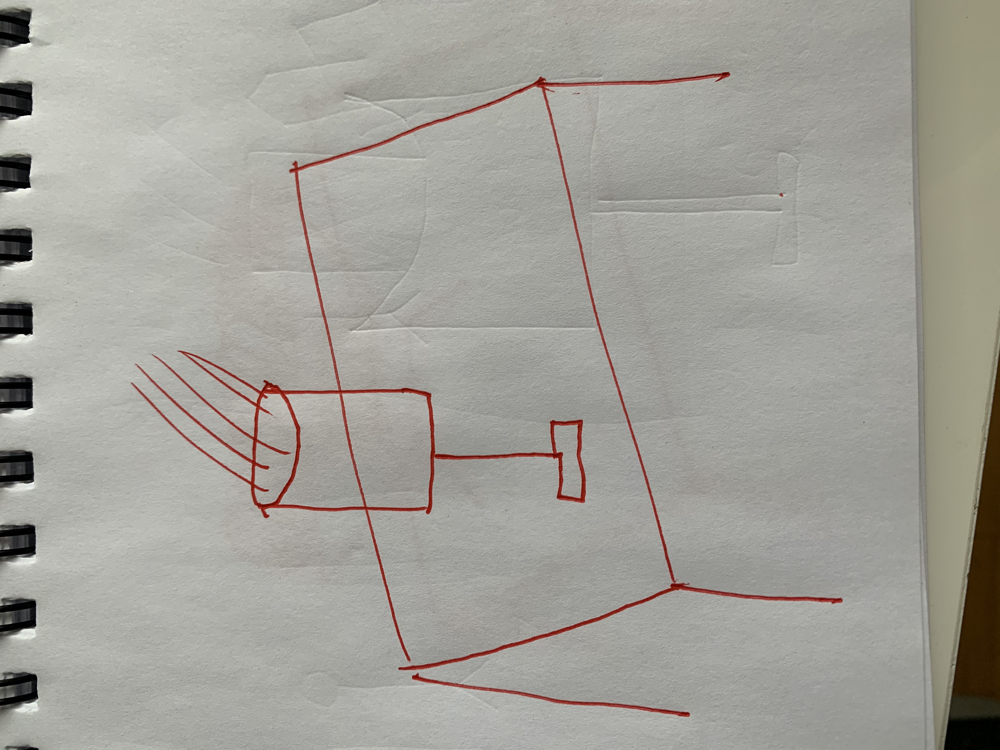

# Staging Interaction

In the original stage production of Peter Pan, Tinker Bell was represented by a darting light created by a small handheld mirror off-stage, reflecting a little circle of light from a powerful lamp. Tinkerbell communicates her presence through this light to the other characters. See more info [here](https://en.wikipedia.org/wiki/Tinker_Bell). 

There is no actor that plays Tinkerbell--her existence in the play comes from the interactions that the other characters have with her.

For lab this week, we draw on this and other inspirations from theatre to stage interactions with a device where the main mode of display/output for the interactive device you are designing is lighting. You will plot the interaction with a storyboard, and use your computer and a smartphone to experiment with what the interactions will look and feel like. _Make sure you read all the instructions and understand the whole of the laboratory activity before starting!_

## Prep

1. Set up [your Github "Lab Hub" repository](../../../) by [following these instructions](https://github.com/FAR-Lab/Developing-and-Designing-Interactive-Devices/blob/2021Spring/readings/Submitting%20Labs.md).
2. Set up the README.md for your Hub repository (for instance, so that it has your name and points to your own Lab 1) and [learn how](https://guides.github.com/features/mastering-markdown/) to post links to your submissions on your readme.md so we can find them easily.

### For lab, you will need:

1. Paper
1. Markers/ Pen
1. Smart Phone--Main required feature is that the phone needs to have a browser and display a webpage.
1. Computer--we will use your computer to host a webpage which also features controls
1. Found objects and materials--you’ll have to costume your phone so that it looks like some other device. These materials can include doll clothes, a paper lantern, a bottle, human clothes, a pillow case. Be creative!
1. Scissors

### Deliverables for this lab are: 
1. Storyboard
1. Sketches/photos of costumed device
1. Any reflections you have on the process.
1. Video sketch of the prototyped interaction.
1. Submit these in the lab1 folder of your class [Github page], either as links or uploaded files. Each group member should post their own copy of the work to their own Lab Hub, even if some of the work is the same for each person in the group.

## Overview
For this assignment, you are going to 

A) [Plan](#part-a-plan) 

B) [Act out the interaction](#part-b-act-out-the-interaction) 

C) [Prototype the device](#part-c-prototype-the-device)

D) [Wizard the device](#part-d-wizard-the-device) 

E) [Costume the device](#part-e-costume-the-device)

F) [Record the interaction](#part-f-record)

## Part A. Plan 

**Describe your setting, players, activity and goals here.**

This device will be in each room of the house, and the players will be guests of the house. When a player enteres the room, the interactive device will tunr on and change colors depending on which room the player is in. The main host of the house can decide which rooms have the colors.

**Include a picture of your storyboard here**

**Summarize feedback you got here.**
* It would be cool if the device changed brightness depending on how close you are to it in the room.
* Maybe there could be a sound in each room that says 'welcome to "room {x}"'

## Part B. Act out the Interaction

**Are there things that seemed better on paper than acted out?**

* It was hard for the user to tell if the device was actually there or not.
* The device itself was too small for the user to see.

**Are there new ideas that occur to you or your collaborators that come up from the acting?**

* The device itself should be pretty noticeble to the user
* The costume should allow for the device to stand out in the room so that they know it is there
* The sounds and lighting should allow for the device to be the center of attention when they walk into the room.

## Part C. Prototype the device

**Give us feedback on Tinkerbelle.**

* I had trouble getting the phone and computer to sync up at times.
* There was occaasionally a lag in between when the control was pressed and the lighting changed colors

## Part D. Wizard the device

## Part E. Costume the device

**Include sketches of what your device might look like here.**

**What concerns or opportunitities are influencing the way you've designed the device to look?**

* The main goal of the costume is to allow the device to be noticable to the user in the room without it looking out of place
* It should be viewed as a main peice of furniture that fits into the room
* The device itself should blend into the room and be noticiable at the same time.

## Part F. Record

**Take a video of your prototyped interaction.**

The video is titled attempt.mov

It showcases how the scene would look if the device changed color as I entered a different room

<video width="320" height="240" controls>
  <source src="attempt.mov" type="video/mp4">
</video>

**Please indicate anyone you collaborated with on this Lab.**
Be generous in acknowledging their contributions! And also recognizing any other influences (e.g. from YouTube, Github, Twitter) that informed your design. 

# Staging Interaction, Part 2 

This describes the second week's work for this lab activity.

## Prep (to be done before Lab on Wednesday)

You will be assigned three partners from another group. Go to their github pages, view their videos, and provide them with reactions, suggestions & feedback: explain to them what you saw happening in their video. Guess the scene and the goals of the character. Ask them about anything that wasn’t clear. 

**Summarize feedback from your partners here.**

## Make it your own

Do last week’s assignment again, but this time: 
1) It doesn’t have to (just) use light, 
2) You can use any modality (e.g., vibration, sound) to prototype the behaviors, 
3) We will be grading with an emphasis on creativity. 

**Document everything here.**
