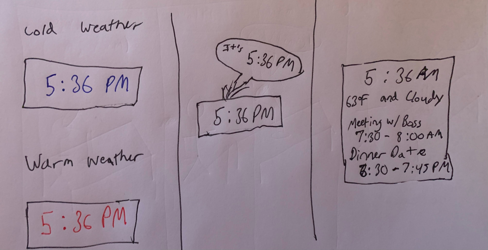

# The Clock of Pi

## Overview
For this assignment, you are going to 

A) [Connect to your Pi](#part-a)  

B) [Try out cli_clock.py](#part-b) 

C) [Set up your RGB display](#part-c)

D) [Try out clock_display_demo](#part-d) 

E) [Modify the code to make the display your own](#part-e)

F) [Make a short video of your modified barebones PiClock](#part-f)

G) [Sketch and brainstorm further interactions and features you would like for your clock for Part 2.](#part-g)

H) [Part 2](#part-h)

## Part A. 
## Connect to your Pi

## Part B. 
### Try out the Command Line Clock

## Part C. 
## Set up your RGB Display

## Part D. 
## Set up the Display Clock Demo

## Part E.
## Modify the barebones clock to make it your own

**A copy of your code should be in your Lab 2 Github repo.**

## Part F. 
## Make a short video of your modified barebones PiClock

**Take a video of your PiClock.**

The user is able to change the color of the clock to a random color by pressing the button (video is clock.mp4).

<video width="320" height="240" controls>
  <source src="clock.mp4" type="video/mp4">
</video>

## Part G. 
## Sketch and brainstorm further interactions and features you would like for your clock for Part 2.

* Integrate the weather for clock color
* Add a speaker so that the time can be announced
* Add more information about the day such as google calendar intergration and weather

## Part H. 

Video is (clock2.mp4)

The modifications made this week allow for the weather to be displayed by on the device.
The openweathermap API is used to get temperature and weather descriptions. Then the screen displays a message summarizing this.
In addition, the screen will display a different background color depending on the temperature. Blue if less than 65, and red if greater than 65.
Finally, the second button is used to manually shift the temperature between 25 and 85 degrees.

<video width="320" height="240" controls>
  <source src="clock2.mp4" type="video/mp4">
</video>
